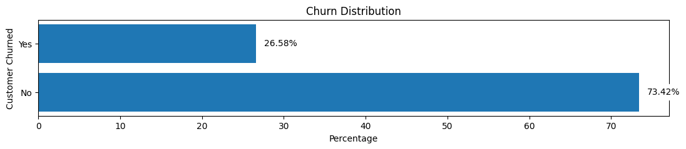
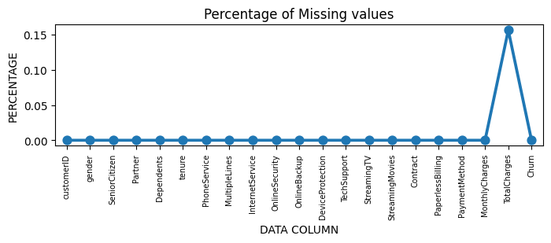
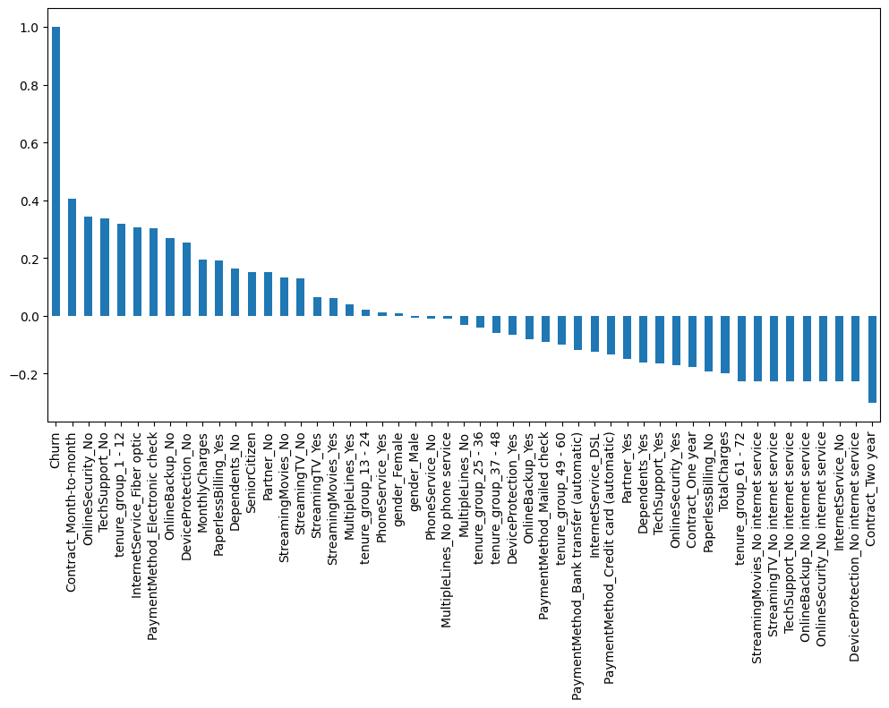
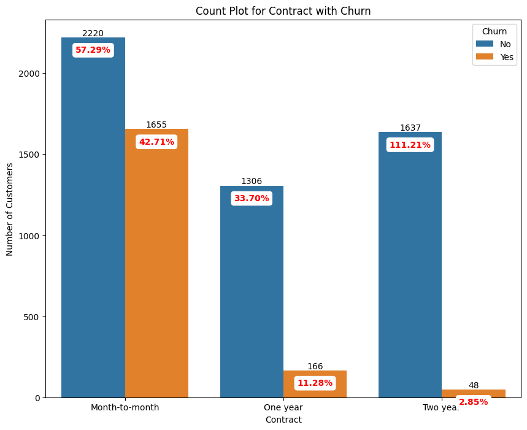
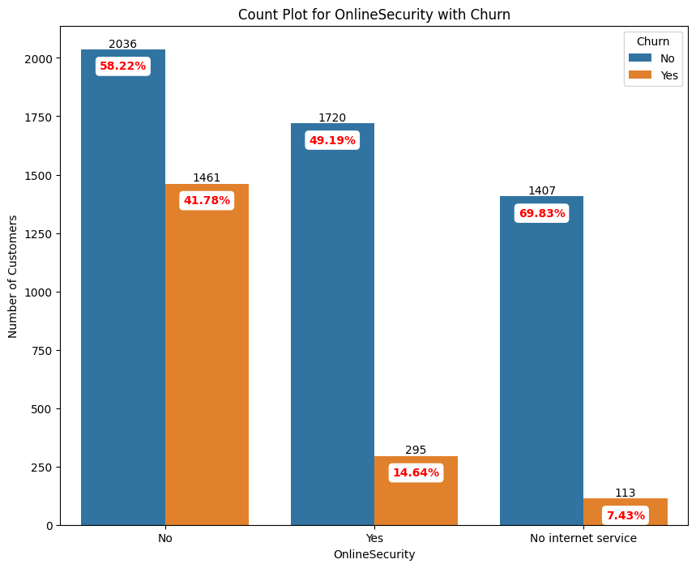
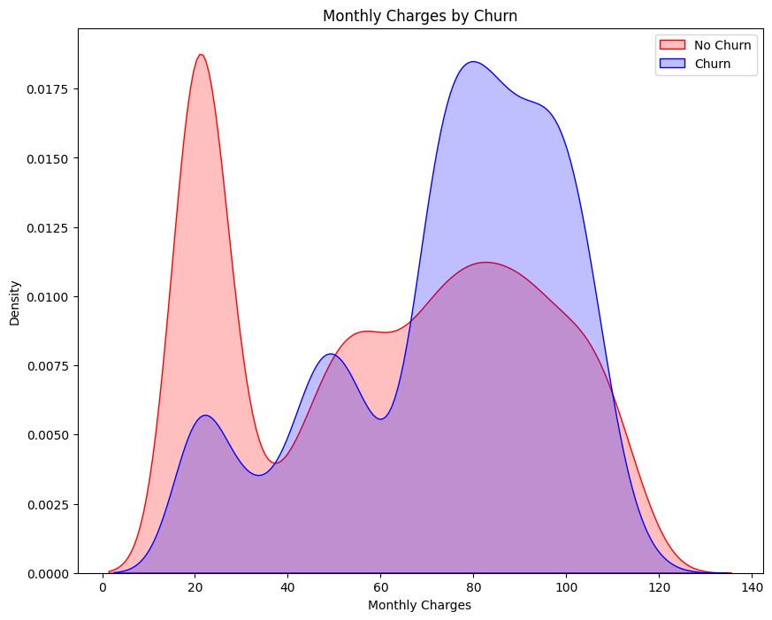
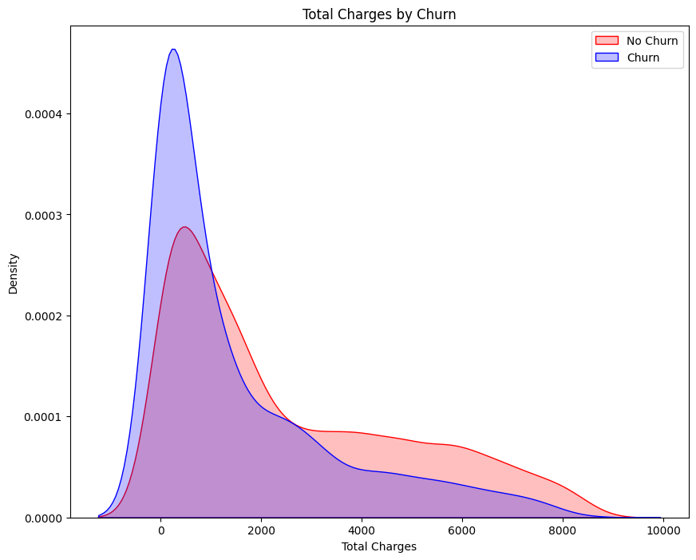

# Telecom Customer Churn Analysis

## Business Understanding and Overview

In the telecom industry, preventing customer churn is crucial for long-term success. This data analysis focuses on understanding customer attrition by conducting Exploratory Data Analysis (EDA) using Python. The goal is to uncover patterns and insights that guide informed decision-making.

### Target Variable
Initial findings show an overall churn rate of 26.58%, serving as our base target value for future comparisons.

### Missing Data Analysis

#### Data Type Correction:
- "Total Charges" column data type corrected to float64 for accurate analysis.

#### Handling Null Values:
- 11 null records in "Total Charges" (0.15% of data) were dropped, resulting in 7032 records.

### Data Cleaning

#### Tenure Grouping for Visualization:
- "Tenure Months" grouped into six bins for improved visualization, creating a new column, "tenure_group."

#### Irrelevant Column Removal:
- "Customer ID" and "Tenure" dropped as irrelevant for focused analysis.

### Initial Findings of Univariate Analysis

- Converted categorical values to numerical using get_dummies.
- Explored correlations between numerical features and "Churn" column.
- Identified attributes associated with higher churn rates.
  

## Univariate Categorical Analysis Highlights

- Customers with attributes like month-to-month contracts (42.71%), no online security (41.78%), no tech support (41.65%) exhibit higher churn.
  

### Other important criteria are:

- Senior citizens (41.68%), customers without partners or dependents (32.98% and 31.28%, respectively), and those with Fiber Optic Internet Service (41.89%) are more likely to churn.
- Different contract types and payment methods influence churn. For example, month-to-month contracts (42.71%) and less than one-year contracts (47.68%) show higher churn.
- The absence of add-on services like online security (41.78%), online backup (39.94%), device protection (39.14%), and tech support (41.65%) increases the likelihood of churn.
- Customers without streaming services are likelier to churn, but interestingly, those with streaming services like TV (30.11%) and movies (29.95%) also show significant churn.
  
## Univariate Numerical Analysis Highlights

- Monthly charges exhibit a clear correlation, indicating that the higher the charges, the more likely customers are to churn.
  
- Total charges also show a correlation, suggesting that lower total charges are associated with a higher likelihood of churn.
  
  
- As expected, customers with lower tenures and higher monthly charges are more likely to churn, as confirmed by the data.

## Next Steps Planned

1. **Detailed Bivariate Analysis:**
   - Conduct a detailed examination of how different factors relate to each other concerning customer churn through bivariate analysis.

2. **Insights Generation:**
   - Summarize key insights from the analysis to highlight crucial patterns and relationships.

3. **Machine Learning Prediction:**
   - Utilize insights to build a machine learning model predicting future churners.

4. **Data-Driven Decision Making:**
   - Integrate advanced analytics and machine learning for data-driven decisions, ensuring competitiveness in the telecom market.

**Stay tuned for further updates as we progress through the analysis!**
